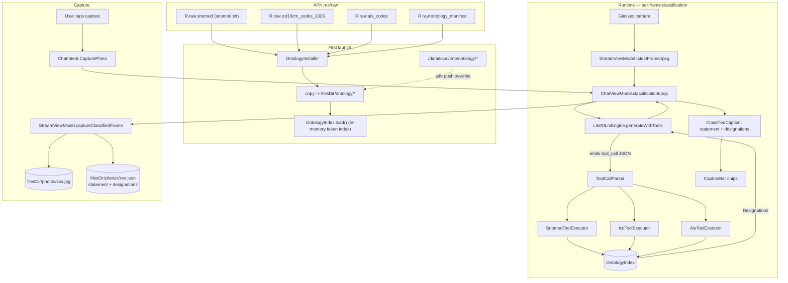
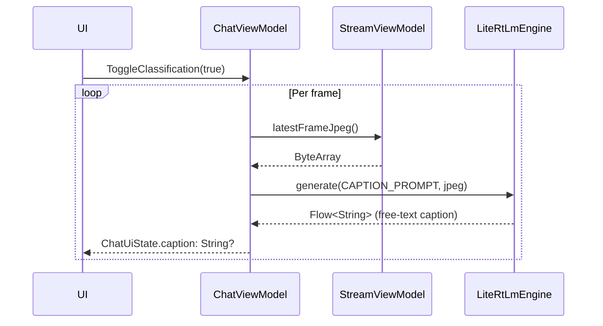
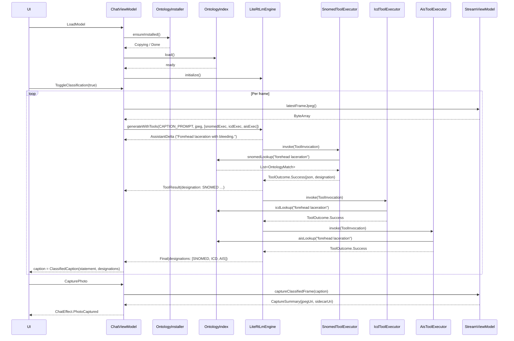

# SNOMED grep tool for Gemma

## Architecture



Design invariants this plan preserves:

- **Offline at runtime.** No network calls, no token prompts for ontology. The `res/raw/` payload plus the first-launch copy are the entire pipeline.
- **Gemma is the source of truth for generation; ontologies are read-only side inputs.** The LLM never mutates ontology state and never executes code — the tool protocol is strictly `<tool_call>{json}</tool_call>` / `<tool_result>{json}</tool_result>` text tags.
- **Per-frame classification budget is the hard latency target.** Every ontology query runs against an in-memory `OntologyIndex` (token-bucket inverted index over preferred terms), not a streaming file scan. A single tool call completes in under 50 ms on a Pixel-class device so it never stretches the classification cadence.
- **The caption is the product, not the chat.** `ClassifiedCaption(statement, designations)` is the canonical output of the classifier; the `<tool_result>` payload is structurally identical to a designation so the caption renderer is a pure projection of what Gemma + the index produced.
- **MVI boundaries stay clean:** UI dispatches `ChatIntent`, view model maps to `ChatUiState`, effects flow through the existing `Channel<ChatEffect>`. Two transitional states (`OntologyInstalling`, `OntologyFailed`) and one new intent (`CapturePhoto`) / one new effect (`PhotoCaptured`) are added.
- **Single canonical on-device location: `getExternalFilesDir(null)/ontology/` for data files and `getExternalFilesDir(null)/photos/` for captures.** Mirrors the `ModelPaths` convention in [mobile_app/app/src/main/java/com/example/oop/llm/ModelPaths.kt](mobile_app/app/src/main/java/com/example/oop/llm/ModelPaths.kt). A legacy `/data/local/tmp/ontology/` path is checked first so `adb push` sideloading of updated TSVs does not require a full reinstall.
- **Three independent tools, one engine contract.** `snomed_lookup`, `icd_lookup`, and `ais_lookup` implement the same `ToolExecutor` interface so adding future ontologies (LOINC, RxNorm, ICD-11) is mechanical.

Assumptions:

- The data files already checked in under [mobile_app/app/src/main/res/raw/](mobile_app/app/src/main/res/raw/) are the authoritative source; preprocessing to produce them is out of scope.
- The SNOMED file is a 4-column TSV with a header row: `ConceptID\tActive\tFSN\tUSPreferredTerm` (429,670 data rows observed).
- The ICD file is whitespace-separated `<code><spaces><description>` with no header (74,715 data rows observed).
- The AIS 1985 file is a human-readable text dump with a documentation preamble, `===`-separated section banners, all-caps section headers (e.g. `EXTERNAL - SKIN`), and data rows shaped `XXXXX.Y  <description>` where the first digit encodes body region and the trailing digit encodes severity (~1,500 data rows).
- Gemma's tool-call tags arrive at turn boundaries, not mid-stream (mid-stream interception is a follow-up). A classification round is structured as: (1) Gemma emits a short clinical statement, then (2) emits one or more `<tool_call>` tags, then (3) emits a terse `designations:` line the caption renderer parses.
- The classification cadence is the existing loop in [`ChatViewModel.classificationLoop`](mobile_app/app/src/main/java/com/example/oop/chat/ChatViewModel.kt); it already throttles on `yield()` / `NO_FRAME_POLL_MS` so this plan does not introduce a new scheduler.
- The APK is delivered via adb / sideload for development; Play Store 150 MB base APK cap is respected but not strictly enforced here.

---

## Code Architecture (walkthrough)

Read this section **top to bottom**. Steps are ordered by dependency: raw-resource inventory defines the payload, paths + installer put files on disk, the in-memory index loads them once, the tool contract wraps the index, the engine drives the tool contract, and the classifier loop + caption UI + capture action consume the engine's structured output. The **File index (alphabetical)** at the end is the canonical lookup.

### Step 1 — Raw resource inventory and manifest

**Goal:** Lock down what ships inside the APK. The existing `res/raw/` directory already holds the two data files we need plus three redundant ICD variants and one optional AIS file; this step trims to the minimum viable set and adds a version manifest so the installer can detect stale copies on upgrade.

| File                                                                                                                             | Symbol                     | Action | Summary                                                                                               |
| -------------------------------------------------------------------------------------------------------------------------------- | -------------------------- | ------ | ----------------------------------------------------------------------------------------------------- |
| [mobile_app/app/src/main/res/raw/snomed.txt](mobile_app/app/src/main/res/raw/snomed.txt)                                         | `R.raw.snomed`             | verify | 4-col TSV: `ConceptID\tActive\tFSN\tUSPreferredTerm`; header row present                              |
| [mobile_app/app/src/main/res/raw/icd10cm_codes_2026.txt](mobile_app/app/src/main/res/raw/icd10cm_codes_2026.txt)                 | `R.raw.icd10cm_codes_2026` | verify | Whitespace-separated `<code><spaces><description>`; no header                                         |
| [mobile_app/app/src/main/res/raw/icd10cm_order_2026.txt](mobile_app/app/src/main/res/raw/icd10cm_order_2026.txt)                 | —                          | remove | Redundant with `icd10cm_codes_2026.txt` (same codes + seq/billable columns we don't use); shrinks APK |
| [mobile_app/app/src/main/res/raw/icd10cm_codes_addenda_2026.txt](mobile_app/app/src/main/res/raw/icd10cm_codes_addenda_2026.txt) | —                          | remove | Year-over-year delta, already folded into the 2026 codes file                                         |
| [mobile_app/app/src/main/res/raw/icd10cm_order_addenda_2026.txt](mobile_app/app/src/main/res/raw/icd10cm_order_addenda_2026.txt) | —                          | remove | Same rationale as above                                                                               |
| [mobile_app/app/src/main/res/raw/ais_codes.txt](mobile_app/app/src/main/res/raw/ais_codes.txt)                                   | `R.raw.ais_codes`          | verify | AIS 1985 complete code list; section-banner + `XXXXX.Y description` data lines                        |
| [mobile_app/app/src/main/res/raw/ontology_manifest.json](mobile_app/app/src/main/res/raw/ontology_manifest.json)                 | `R.raw.ontology_manifest`  | add    | Version gate for the installer                                                                        |

`ontology_manifest.json` starts minimal:

```json
{
  "version": 1,
  "snomed": { "resource": "snomed", "rows": 429670 },
  "icd10cm": { "resource": "icd10cm_codes_2026", "rows": 74715 },
  "ais1985": { "resource": "ais_codes", "rows": 1507 }
}
```

**Invariant:** Bumping `version` forces `OntologyInstaller` to wipe and recopy on next launch. Any time a TSV's byte content changes (new SNOMED release, new ICD year), bump this integer in the same commit so devices refresh.

**Note:** `res/raw/` resource names must be lowercase and cannot start with a digit; `icd10cm_codes_2026` satisfies this (letters first, underscores OK). No rename required.

### Step 2 — On-device paths

**Goal:** Give every downstream component a single resolver for ontology file locations, mirroring the `ModelPaths` object the Gemma code already uses.

| File                                                                                                                                             | Symbol                 | Action | Summary                                                                                                                  |
| ------------------------------------------------------------------------------------------------------------------------------------------------ | ---------------------- | ------ | ------------------------------------------------------------------------------------------------------------------------ |
| [mobile_app/app/src/main/java/com/example/oop/ontology/OntologyPaths.kt](mobile_app/app/src/main/java/com/example/oop/ontology/OntologyPaths.kt) | `object OntologyPaths` | add    | Maps resource IDs → destination filenames, exposes install dir, adb legacy override, and `resolveExisting`/`isInstalled` |

```kotlin
// mobile_app/app/src/main/java/com/example/oop/ontology/OntologyPaths.kt
package com.example.oop.ontology

import android.content.Context
import com.example.oop.R
import java.io.File

object OntologyPaths {
    const val LEGACY_ADB_DIR = "/data/local/tmp/ontology"

    data class Source(val resId: Int, val fileName: String)

    val SNOMED = Source(R.raw.snomed, "snomed.txt")
    val ICD = Source(R.raw.icd10cm_codes_2026, "icd10cm_codes_2026.txt")
    val AIS = Source(R.raw.ais_codes, "ais_codes.txt")
    val MANIFEST = Source(R.raw.ontology_manifest, "ontology_manifest.json")

    fun installDir(context: Context): File =
        File(context.getExternalFilesDir(null) ?: context.filesDir, "ontology").apply { mkdirs() }

    fun snomedFile(context: Context): File = resolve(context, SNOMED.fileName)
    fun icdFile(context: Context): File = resolve(context, ICD.fileName)
    fun aisFile(context: Context): File = resolve(context, AIS.fileName)
    fun manifestFile(context: Context): File = resolve(context, MANIFEST.fileName)

    private fun resolve(context: Context, name: String): File {
        val legacy = File(LEGACY_ADB_DIR, name)
        if (legacy.exists()) return legacy
        return File(installDir(context), name)
    }

    fun isInstalled(context: Context): Boolean =
        snomedFile(context).exists() &&
            icdFile(context).exists() &&
            aisFile(context).exists() &&
            manifestFile(context).exists()
}
```

**Caller(s):** `OntologyInstaller` (Step 3), `OntologyGrepper` (Step 4), `ChatViewModel.loadModel` (Step 7).
**Invariant:** Every lookup goes through `resolve()` so the adb override at `/data/local/tmp/ontology/` is honored uniformly.

### Step 3 — First-launch installer

**Goal:** Copy the raw resources out of the APK exactly once per `manifest.version` so the runtime code can treat them as regular `File`s (grep-able via `adb shell run-as`, opened as `FileInputStream` without decompression cost on every query).

| File                                                                                                                                                     | Symbol                          | Action | Summary                                                                   |
| -------------------------------------------------------------------------------------------------------------------------------------------------------- | ------------------------------- | ------ | ------------------------------------------------------------------------- |
| [mobile_app/app/src/main/java/com/example/oop/ontology/OntologyInstaller.kt](mobile_app/app/src/main/java/com/example/oop/ontology/OntologyInstaller.kt) | `class OntologyInstaller`       | add    | Copies each `R.raw.*` → `filesDir/ontology/*`; emits `Flow<InstallState>` |
| [mobile_app/app/src/main/java/com/example/oop/ontology/InstallState.kt](mobile_app/app/src/main/java/com/example/oop/ontology/InstallState.kt)           | `sealed interface InstallState` | add    | `Copying(file, bytes, total)`, `Done`, `Failed(message)`                  |

**Inputs:** `Context` (for `Resources.openRawResource` + filesDir lookup).
**Outputs:** Three files under `installDir(context)`; `Flow<InstallState>` for UI progress.
**Error handling:** IO failures close and delete the partial `.part` file and emit `InstallState.Failed`. A `manifest.version` mismatch wipes `installDir` and recopies. If an adb override file is present for a given name, `OntologyPaths.resolveExisting` routes around it and the installer skips that entry.
**Dependencies:** `android.content.res.Resources`, `kotlinx.coroutines`. No new Gradle dependencies.

Signatures:

```kotlin
// mobile_app/app/src/main/java/com/example/oop/ontology/OntologyInstaller.kt
package com.example.oop.ontology

import android.content.Context
import kotlinx.coroutines.Dispatchers
import kotlinx.coroutines.flow.Flow
import kotlinx.coroutines.flow.flow
import kotlinx.coroutines.flow.flowOn
import java.io.File

class OntologyInstaller(private val context: Context) {
    fun ensureInstalled(): Flow<InstallState> = flow {
        if (shouldSkipInstall()) {
            emit(InstallState.Done)
            return@flow
        }
        val dest = OntologyPaths.installDir(context)
        dest.listFiles()?.forEach { it.delete() }

        for (source in listOf(
            OntologyPaths.MANIFEST,
            OntologyPaths.SNOMED,
            OntologyPaths.ICD,
            OntologyPaths.AIS,
        )) {
            val target = File(dest, source.fileName)
            val part = File(dest, "${source.fileName}.part")
            val total = estimateSize(source.resId)
            emit(InstallState.Copying(source.fileName, bytes = 0L, total = total))
            runCatching { copyRawResource(source.resId, part) }
                .onFailure { t ->
                    part.delete()
                    emit(InstallState.Failed(t.message ?: "Install failed: ${source.fileName}"))
                    return@flow
                }
            if (!part.renameTo(target)) {
                part.delete()
                emit(InstallState.Failed("Failed to finalize ${source.fileName}"))
                return@flow
            }
        }
        emit(InstallState.Done)
    }.flowOn(Dispatchers.IO)

    private fun shouldSkipInstall(): Boolean {
        if (!OntologyPaths.isInstalled(context)) return false
        val installed = readInstalledManifestVersion() ?: return false
        val bundled = readBundledManifestVersion()
        return installed == bundled
    }

    private fun copyRawResource(resId: Int, dest: File) {
        context.resources.openRawResource(resId).use { input ->
            dest.outputStream().use { output -> input.copyTo(output, bufferSize = 1 shl 16) }
        }
    }

    // estimateSize uses context.resources.openRawResourceFd(resId)?.length when available
    // (uncompressed raw); falls back to -1 for compressed assets. Used only for UI progress.
    // readInstalledManifestVersion parses the "version" int out of filesDir manifest.
    // readBundledManifestVersion parses the same out of R.raw.ontology_manifest.
}
```

**Invariant:** The installer is idempotent and safe to call on every launch. On already-installed devices with a matching version it returns `Done` without touching disk.

**Ordering note:** If an adb override exists at `/data/local/tmp/ontology/<name>`, `OntologyPaths.isInstalled` resolves the path to the override (already on disk) and `shouldSkipInstall` returns true for that entry. Developers sideload TSV updates without a full reinstall.

### Step 4 — In-memory ontology index

**Goal:** Provide a pure-Kotlin lookup the tool executors call **without touching disk per query**. The classification loop fires many queries per minute; a streaming scan of the 60 MB SNOMED file is too slow. On first use after install, the index parses each TSV once, holds only the columns we actually project (`primaryId`, `preferredTerm`, optional `fsn`, section/severity for AIS), and builds a token → record-id inverted index that satisfies every query in sub-50 ms. The classic "grep" is still there as the fallback path when fewer than two tokens match.

| File                                                                                                                                                                           | Symbol                                                                            | Action | Summary                                                                                                                                                                                          |
| ------------------------------------------------------------------------------------------------------------------------------------------------------------------------------ | --------------------------------------------------------------------------------- | ------ | ------------------------------------------------------------------------------------------------------------------------------------------------------------------------------------------------ |
| [mobile_app/app/src/main/java/com/example/oop/ontology/OntologyMatch.kt](mobile_app/app/src/main/java/com/example/oop/ontology/OntologyMatch.kt)                               | `data class OntologyMatch`, `data class OntologyRecord`, `data class Designation` | add    | DTOs returned by the index. `Designation` is the compact projection the caption UI renders and the capture sidecar persists.                                                                     |
| [mobile_app/app/src/main/java/com/example/oop/ontology/OntologyIndex.kt](mobile_app/app/src/main/java/com/example/oop/ontology/OntologyIndex.kt)                               | `class OntologyIndex`                                                             | add    | Thread-safe singleton. `load(context)` parses all three TSVs off `Dispatchers.IO` once; `snomedLookup / icdLookup / aisLookup / lookupAisByCode` are suspendless lookups against in-memory data. |
| [mobile_app/app/src/main/java/com/example/oop/ontology/AisSeverity.kt](mobile_app/app/src/main/java/com/example/oop/ontology/AisSeverity.kt)                                   | `enum class AisSeverity`, `object AisBodyRegion`                                  | add    | Decode severity digit and body-region digit into labels used in tool output                                                                                                                      |
| [mobile_app/app/src/main/java/com/example/oop/ontology/OntologyUnavailableException.kt](mobile_app/app/src/main/java/com/example/oop/ontology/OntologyUnavailableException.kt) | `class OntologyUnavailableException`                                              | add    | Thrown when a data file is missing at load time                                                                                                                                                  |

**Inputs:** `query: String` (free text from the model), `limit: Int` (caller-capped; default 5, max 16 — tighter than before because per-frame budget is the constraint).
**Outputs:** `List<OntologyMatch>`; empty on no hits.
**Error handling:** Files missing at `load()` time → `OntologyUnavailableException`; malformed lines are skipped with a log warning. Queries shorter than 2 chars after sanitization return empty.
**Dependencies:** `kotlinx.coroutines.Dispatchers.IO`, `java.util.concurrent.atomic.AtomicReference`. No third-party deps.

```kotlin
// mobile_app/app/src/main/java/com/example/oop/ontology/OntologyMatch.kt
package com.example.oop.ontology

data class OntologyRecord(
    val primaryId: String,                       // SNOMED ConceptID or ICD-10 code or AIS XXXXX.Y
    val preferredTerm: String,                   // SNOMED USPreferredTerm | ICD description | AIS description
    val fullySpecifiedName: String? = null,      // SNOMED FSN only
    val section: String? = null,                 // AIS section banner (e.g. "EXTERNAL - SKIN")
    val bodyRegion: String? = null,              // AIS body-region label from first digit
    val severity: AisSeverity? = null,           // AIS severity enum from trailing digit
)

data class OntologyMatch(
    val record: OntologyRecord,
    val matchedField: String,                    // "preferred" | "fsn" | "code" | "description"
    val score: Int,                              // higher is better
)

/**
 * Compact projection rendered on the caption and stored in capture sidecars.
 * One of these per ontology (SNOMED / ICD / AIS) is all the caption needs.
 */
data class Designation(
    val source: String,                          // "snomed" | "icd10cm" | "ais1985"
    val primaryId: String,                       // e.g. "44054006", "E11.9", "21402.3"
    val preferredTerm: String,                   // human-readable term
    val detail: String? = null,                  // AIS severity label or SNOMED FSN
)
```

```kotlin
// mobile_app/app/src/main/java/com/example/oop/ontology/AisSeverity.kt
package com.example.oop.ontology

enum class AisSeverity(val digit: Char, val label: String) {
    MINOR('1', "Minor"),
    MODERATE('2', "Moderate"),
    SERIOUS('3', "Serious"),
    SEVERE('4', "Severe"),
    CRITICAL('5', "Critical"),
    MAXIMUM('6', "Maximum (virtually unsurvivable)"),
    UNKNOWN('9', "Unknown");

    companion object {
        fun fromDigit(d: Char): AisSeverity? = entries.firstOrNull { it.digit == d }
    }
}

object AisBodyRegion {
    private val TABLE: Map<Char, String> = mapOf(
        '1' to "External",
        '2' to "Head",
        '3' to "Face",
        '4' to "Neck",
        '5' to "Thorax",
        '6' to "Abdomen & Pelvic Contents",
        '7' to "Spine",
        '8' to "Upper Extremity",
        '9' to "Lower Extremity",
    )
    fun labelFor(d: Char): String? = TABLE[d]
}
```

```kotlin
// mobile_app/app/src/main/java/com/example/oop/ontology/OntologyIndex.kt
package com.example.oop.ontology

import android.content.Context
import kotlinx.coroutines.Dispatchers
import kotlinx.coroutines.sync.Mutex
import kotlinx.coroutines.sync.withLock
import kotlinx.coroutines.withContext
import java.io.File

/**
 * Holds SNOMED / ICD / AIS records entirely in memory along with a token
 * inverted index over `preferredTerm` tokens. Build cost: ~3–5 s on a Pixel 6
 * at first launch (after the installer has staged files to disk). Query cost:
 * O(smallest-posting-list) intersections, typically < 10 ms.
 *
 * Intentionally not a `suspend` API after load(): all lookups are synchronous
 * so the classification hot path never context-switches through Dispatchers.IO.
 */
class OntologyIndex(private val context: Context) {

    private data class Shard(
        val records: List<OntologyRecord>,
        val termIndex: Map<String, IntArray>,        // lowercase token -> sorted record ids
        val primaryIdIndex: Map<String, Int>,        // exact id -> record id (SNOMED ConceptID, ICD code, AIS code)
    )

    private val loadMutex = Mutex()
    @Volatile private var snomed: Shard? = null
    @Volatile private var icd: Shard? = null
    @Volatile private var ais: Shard? = null

    val isLoaded: Boolean get() = snomed != null && icd != null && ais != null

    suspend fun load(): Unit = loadMutex.withLock {
        if (isLoaded) return
        withContext(Dispatchers.IO) {
            snomed = buildSnomed(OntologyPaths.snomedFile(context))
            icd = buildIcd(OntologyPaths.icdFile(context))
            ais = buildAis(OntologyPaths.aisFile(context))
        }
    }

    fun snomedLookup(query: String, limit: Int = 5): List<OntologyMatch> =
        lookup(snomed ?: throw OntologyUnavailableException("snomed"), query, limit)

    fun icdLookup(query: String, limit: Int = 5): List<OntologyMatch> =
        lookup(icd ?: throw OntologyUnavailableException("icd10cm"), query, limit)

    fun aisLookup(query: String, limit: Int = 5): List<OntologyMatch> =
        lookup(ais ?: throw OntologyUnavailableException("ais1985"), query, limit)

    fun lookupAisByCode(code: String): OntologyMatch? {
        val shard = ais ?: throw OntologyUnavailableException("ais1985")
        val id = shard.primaryIdIndex[code.trim()] ?: return null
        return OntologyMatch(shard.records[id], matchedField = "code", score = EXACT_CODE)
    }

    private fun lookup(shard: Shard, query: String, limit: Int): List<OntologyMatch> {
        val tokens = tokenize(query)
        if (tokens.isEmpty()) return emptyList()

        // Exact primaryId hit (ICD code, AIS code) wins immediately.
        shard.primaryIdIndex[query.trim()]?.let { rid ->
            return listOf(OntologyMatch(shard.records[rid], matchedField = "code", score = EXACT_CODE))
        }

        // Collect candidate record ids by intersecting postings of known tokens.
        val postings = tokens.mapNotNull { shard.termIndex[it] }
        if (postings.isEmpty()) return emptyList()
        val candidates = intersectOrUnion(postings, preferIntersection = postings.size >= 2)

        // Rank candidates by scoring their preferred term / fsn against the raw query.
        val needle = sanitize(query)
        val cap = limit.coerceAtMost(MAX_LIMIT)
        val hits = ArrayList<OntologyMatch>(cap * 4)
        for (rid in candidates) {
            val rec = shard.records[rid]
            val scored = score(rec, needle) ?: continue
            hits += scored
            if (hits.size >= cap * 8) break
        }
        return hits.sortedByDescending { it.score }.take(cap)
    }

    // tokenize(q): lowercase, split on [^a-z0-9]+, drop stopwords + length < 2
    // intersectOrUnion(lists, preferIntersection): galloping intersection when >= 2 postings
    //   overlap; else union capped at MAX_CANDIDATES.
    // score: EXACT_PREFERRED > PREFIX_PREFERRED > EXACT_FSN > CONTAINS_PREFERRED > CONTAINS_FSN
    // sanitize: trim, lowercase, collapse whitespace, strip control chars.
    // buildSnomed: parse 4-col TSV, require Active == "1", keep ConceptID + FSN + Preferred; tokenize
    //   preferredTerm+fsn; build termIndex entries; primaryIdIndex keyed on ConceptID.
    // buildIcd: parse whitespace 2-col; tokenize description; primaryIdIndex keyed on code.
    // buildAis: walk section banners + XXXXX.Y lines; attach section/bodyRegion/severity; tokenize
    //   description + section; primaryIdIndex keyed on code.

    private companion object {
        const val MAX_LIMIT = 16
        const val MAX_CANDIDATES = 4096
        const val EXACT_CODE = 1200
        const val EXACT_PREFERRED = 1000
        const val PREFIX_PREFERRED = 700
        const val EXACT_FSN = 600
        const val CONTAINS_PREFERRED = 200
        const val CONTAINS_FSN = 100
    }
}
```

Designation projection — exposed as a small helper so the executors and the capture writer agree on shape:

```kotlin
// (co-located with OntologyMatch.kt)
fun OntologyMatch.toDesignation(source: String): Designation = Designation(
    source = source,
    primaryId = record.primaryId,
    preferredTerm = record.preferredTerm,
    detail = when (source) {
        "snomed" -> record.fullySpecifiedName
        "ais1985" -> record.severity?.label
        else -> null
    },
)
```

**Invariant:** `load()` is idempotent and guarded by a `Mutex`; only the first caller pays the parse cost. After load, all `*Lookup` methods are synchronous and allocation-light (`IntArray` postings, `ArrayList` of records). The classification hot path never waits on disk.

**Memory budget:** ~429 k SNOMED rows × (ConceptID + preferred + FSN) ≈ 60–80 MB on heap; ICD ≈ 6 MB; AIS negligible. If profiling shows heap pressure, drop `fullySpecifiedName` from the in-memory record and re-parse on hover — noted in Out of scope.

**AIS parsing note:** Same rules as before — walk `===`-banners, track the most recently seen uppercase section header, match rows with `^\d{5}\.\d\s+description$`. Decomposed bodyRegion + severity are cached on the record so a hit doesn't re-decompose per query.

### Step 5 — Tool contract and three executors

**Goal:** Define the string protocol Gemma speaks and bind each tool name to the right `OntologyIndex` method. Pure adapter code; the engine loop in Step 6 never knows about SNOMED / ICD / AIS specifically. Each `ToolOutcome.Success` payload includes both the raw `matches` and the compact `designation` projection so `ChatViewModel` can drop the top designation into the caption without re-running the match selection.

| File                                                                                                                                                         | Symbol                                                    | Action | Summary                                                                                                                        |
| ------------------------------------------------------------------------------------------------------------------------------------------------------------ | --------------------------------------------------------- | ------ | ------------------------------------------------------------------------------------------------------------------------------ |
| [mobile_app/app/src/main/java/com/example/oop/llm/tools/ToolExecutor.kt](mobile_app/app/src/main/java/com/example/oop/llm/tools/ToolExecutor.kt)             | `interface ToolExecutor`, `ToolInvocation`, `ToolOutcome` | add    | Shared contract between engine and tools                                                                                       |
| [mobile_app/app/src/main/java/com/example/oop/llm/tools/ToolCallParser.kt](mobile_app/app/src/main/java/com/example/oop/llm/tools/ToolCallParser.kt)         | `object ToolCallParser`                                   | add    | Extracts the first `<tool_call>{json}</tool_call>` from a buffer                                                               |
| [mobile_app/app/src/main/java/com/example/oop/llm/tools/SnomedToolExecutor.kt](mobile_app/app/src/main/java/com/example/oop/llm/tools/SnomedToolExecutor.kt) | `class SnomedToolExecutor`                                | add    | `name = "snomed_lookup"`; calls `OntologyIndex.snomedLookup` and JSON-encodes matches + `designation`                          |
| [mobile_app/app/src/main/java/com/example/oop/llm/tools/IcdToolExecutor.kt](mobile_app/app/src/main/java/com/example/oop/llm/tools/IcdToolExecutor.kt)       | `class IcdToolExecutor`                                   | add    | `name = "icd_lookup"`; calls `OntologyIndex.icdLookup`                                                                         |
| [mobile_app/app/src/main/java/com/example/oop/llm/tools/AisToolExecutor.kt](mobile_app/app/src/main/java/com/example/oop/llm/tools/AisToolExecutor.kt)       | `class AisToolExecutor`                                   | add    | `name = "ais_lookup"`; accepts `{query}` or `{code}`; calls `aisLookup` or `lookupAisByCode`                                   |
| [mobile_app/app/build.gradle.kts](mobile_app/app/build.gradle.kts)                                                                                           | `plugins`, `dependencies`                                 | modify | Add `org.jetbrains.kotlin.plugin.serialization` and `implementation("org.jetbrains.kotlinx:kotlinx-serialization-json:1.6.3")` |
| [mobile_app/build.gradle.kts](mobile_app/build.gradle.kts)                                                                                                   | top-level `plugins`                                       | modify | Declare `kotlin("plugin.serialization") version <kotlin-version> apply false`                                                  |

**Inputs:** `ToolInvocation(name, arguments: JsonObject, rawTag)`.
**Outputs:** `ToolOutcome.Success(json, designation)` or `ToolOutcome.Error(code, message)`. The engine wraps either into `<tool_result>{json}</tool_result>` AND exposes the strongly-typed `designation` back to the view model on `TurnEvent.ToolResult`.
**Error handling:** unknown tool name → `Error("unknown_tool", name)`; `OntologyUnavailableException` → `Error("ontology_unavailable", msg)`; bad argument shape → `Error("bad_arguments", msg)`.
**Dependencies:** `kotlinx.serialization` for deterministic JSON; `OntologyIndex` from Step 4.

```kotlin
// mobile_app/app/src/main/java/com/example/oop/llm/tools/ToolExecutor.kt
package com.example.oop.llm.tools

import com.example.oop.ontology.Designation
import kotlinx.serialization.json.JsonObject

data class ToolInvocation(val name: String, val arguments: JsonObject, val rawTag: String)

sealed interface ToolOutcome {
    /**
     * @param json the serialized payload wrapped in `<tool_result>…</tool_result>` and fed
     *   back to the model
     * @param designation top-ranked match projected for the caption UI; null when no match
     */
    data class Success(val json: String, val designation: Designation?) : ToolOutcome
    data class Error(val code: String, val message: String) : ToolOutcome
}

interface ToolExecutor {
    val name: String
    suspend fun invoke(invocation: ToolInvocation): ToolOutcome
}
```

```kotlin
// mobile_app/app/src/main/java/com/example/oop/llm/tools/ToolCallParser.kt
object ToolCallParser {
    private val TAG_REGEX = Regex("<tool_call>\\s*(\\{.*?\\})\\s*</tool_call>", RegexOption.DOT_MATCHES_ALL)

    fun firstInvocation(buffer: String): ToolInvocation? {
        val match = TAG_REGEX.find(buffer) ?: return null
        return runCatching {
            val obj = Json.parseToJsonElement(match.groupValues[1]).jsonObject
            val name = obj["name"]?.jsonPrimitive?.content ?: return null
            val args = obj["arguments"]?.jsonObject ?: buildJsonObject {}
            ToolInvocation(name = name, arguments = args, rawTag = match.value)
        }.getOrNull()
    }
}
```

```kotlin
// mobile_app/app/src/main/java/com/example/oop/llm/tools/SnomedToolExecutor.kt
class SnomedToolExecutor(private val index: OntologyIndex) : ToolExecutor {
    override val name: String = "snomed_lookup"
    override suspend fun invoke(invocation: ToolInvocation): ToolOutcome {
        val query = invocation.arguments["query"]?.jsonPrimitive?.contentOrNull
            ?: return ToolOutcome.Error("bad_arguments", "missing 'query'")
        val limit = invocation.arguments["limit"]?.jsonPrimitive?.intOrNull ?: 5
        return try {
            val matches = index.snomedLookup(query, limit)
            val designation = matches.firstOrNull()?.toDesignation(source = "snomed")
            ToolOutcome.Success(
                json = encodeMatchesJson(source = "snomed", matches = matches, designation = designation),
                designation = designation,
            )
        } catch (e: OntologyUnavailableException) {
            ToolOutcome.Error("ontology_unavailable", e.message ?: "SNOMED missing")
        }
    }
}
```

`IcdToolExecutor` is structurally identical: `name = "icd_lookup"`, calls `index.icdLookup`, tags `source = "icd10cm"`.

```kotlin
// mobile_app/app/src/main/java/com/example/oop/llm/tools/AisToolExecutor.kt
class AisToolExecutor(private val index: OntologyIndex) : ToolExecutor {
    override val name: String = "ais_lookup"
    override suspend fun invoke(invocation: ToolInvocation): ToolOutcome {
        val args = invocation.arguments
        val code = args["code"]?.jsonPrimitive?.contentOrNull
        val query = args["query"]?.jsonPrimitive?.contentOrNull
        val limit = args["limit"]?.jsonPrimitive?.intOrNull ?: 5
        if (code.isNullOrBlank() && query.isNullOrBlank()) {
            return ToolOutcome.Error("bad_arguments", "missing 'query' or 'code'")
        }
        return try {
            val matches = if (!code.isNullOrBlank()) {
                listOfNotNull(index.lookupAisByCode(code.trim()))
            } else {
                index.aisLookup(query!!, limit)
            }
            val designation = matches.firstOrNull()?.toDesignation(source = "ais1985")
            // encodeMatchesJson emits per-record: primaryId, preferredTerm, section, bodyRegion,
            // severity (digit + label), matchedField, score. source = "ais1985".
            ToolOutcome.Success(
                json = encodeMatchesJson(source = "ais1985", matches = matches, designation = designation),
                designation = designation,
            )
        } catch (e: OntologyUnavailableException) {
            ToolOutcome.Error("ontology_unavailable", e.message ?: "AIS missing")
        }
    }
}
```

**Invariant:** Only the _first_ `<tool_call>` in a turn's buffer is executed per loop iteration. Multi-call turns handled by subsequent iterations.

### Step 6 — Tool-call loop in `LiteRtLmEngine`

**Goal:** Extend the engine so `ChatViewModel` has a single `generateWithTools` entry point, and Gemma has a published contract for when to emit a tool call.

| File                                                                                                                                     | Symbol                               | Action | Summary                                                                                                       |
| ---------------------------------------------------------------------------------------------------------------------------------------- | ------------------------------------ | ------ | ------------------------------------------------------------------------------------------------------------- |
| [mobile_app/app/src/main/java/com/example/oop/llm/LiteRtLmEngine.kt](mobile_app/app/src/main/java/com/example/oop/llm/LiteRtLmEngine.kt) | `LiteRtLmEngine.generate`            | verify | Keep existing signature/behavior; retained for backward compatibility                                         |
| [mobile_app/app/src/main/java/com/example/oop/llm/LiteRtLmEngine.kt](mobile_app/app/src/main/java/com/example/oop/llm/LiteRtLmEngine.kt) | `LiteRtLmEngine.generateWithTools`   | add    | Turn-boundary tool loop, bounded rounds, emits `TurnEvent` flow                                               |
| [mobile_app/app/src/main/java/com/example/oop/llm/LiteRtLmEngine.kt](mobile_app/app/src/main/java/com/example/oop/llm/LiteRtLmEngine.kt) | `sealed interface TurnEvent`         | add    | `AssistantDelta(text)`, `ToolCall(name, args)`, `ToolResult(json, designation?)`, `Final(text, designations)` |
| [mobile_app/app/src/main/java/com/example/oop/llm/LiteRtLmEngine.kt](mobile_app/app/src/main/java/com/example/oop/llm/LiteRtLmEngine.kt) | `LiteRtLmEngine.installSystemPrompt` | add    | Idempotent; sent once per conversation, reset by `reset()` and `close()`                                      |

**Inputs:** `prompt: String`, `imageBytes: ByteArray?`, `tools: List<ToolExecutor>`, `maxRounds: Int = 4`.
**Outputs:** `Flow<TurnEvent>`; `Final` is always the terminal event.
**Error handling:** Generation failures propagate as flow exceptions (matches current `generate`). Tool errors emit as `ToolResult` with an error JSON payload and the loop continues so the model can gracefully degrade.
**Dependencies:** `Conversation.sendMessageAsync` (existing), `ToolCallParser`, `ToolExecutor`.
**Compatibility:** `generate()` keeps its current signature; nothing else in the plan calls it.

System prompt contract (sent once per conversation). The classifier loop and any future chat flow use the **same** contract:

```text
You are analyzing a single frame from a clinician's smart glasses. For every turn:

1. First, emit ONE short sentence describing clinically-relevant content in the frame.
   If nothing is clinically relevant, say so plainly and stop.

2. Then, for each distinct clinical finding, injury, or condition you named, issue a
   tool_call to the matching ontology and STOP generating until the runtime replies:

   - snomed_lookup : SNOMED CT concepts (preferred term, FSN, ConceptID)
   - icd_lookup    : ICD-10-CM diagnosis codes (alphanumeric, e.g. E11.9)
   - ais_lookup    : Abbreviated Injury Scale 1985 codes (XXXXX.Y, body region + severity)

   Example call:
   <tool_call>{"name":"snomed_lookup","arguments":{"query":"laceration forehead","limit":5}}</tool_call>
   <tool_call>{"name":"ais_lookup","arguments":{"query":"laceration forehead","limit":5}}</tool_call>
   <tool_call>{"name":"ais_lookup","arguments":{"code":"21402.3"}}</tool_call>

3. The runtime will reply with:
   <tool_result>{"source":"snomed","matches":[...],"designation":{"primaryId":"44054006","preferredTerm":"...","detail":"..."}}</tool_result>

4. When you have enough designations, emit ONE final line exactly in this shape and
   STOP:
   designations: SNOMED <id> <term>; ICD10 <code> <term>; AIS <code> <label>

Do not invent tool_result content. Omit an ontology from the designations line if no
match was found.
```

Loop shape:

```kotlin
// mobile_app/app/src/main/java/com/example/oop/llm/LiteRtLmEngine.kt
sealed interface TurnEvent {
    data class AssistantDelta(val text: String) : TurnEvent
    data class ToolCall(val name: String, val arguments: JsonObject) : TurnEvent
    data class ToolResult(val json: String, val designation: Designation?) : TurnEvent
    /**
     * @param text everything the model emitted this turn (deltas concatenated)
     * @param designations the accumulated top-ranked designations this turn, one per
     *   distinct tool name invoked. Ordering follows invocation order.
     */
    data class Final(val text: String, val designations: List<Designation>) : TurnEvent
}

fun generateWithTools(
    prompt: String,
    imageBytes: ByteArray? = null,
    tools: List<ToolExecutor>,
    maxRounds: Int = 4,
): Flow<TurnEvent> = flow {
    installSystemPrompt()
    var nextMessage: Message = buildUserMessage(prompt, imageBytes)
    var roundsRemaining = maxRounds
    val full = StringBuilder()
    val designations = LinkedHashMap<String, Designation>()

    while (true) {
        val turnText = StringBuilder()
        activeConversation.sendMessageAsync(nextMessage).collect { token ->
            turnText.append(extractDelta(token))
            emit(TurnEvent.AssistantDelta(turnText.toString()))
        }
        full.append(turnText)

        val invocation = ToolCallParser.firstInvocation(turnText.toString())
        if (invocation == null || roundsRemaining-- <= 0) {
            emit(TurnEvent.Final(full.toString(), designations.values.toList()))
            return@flow
        }

        val executor = tools.firstOrNull { it.name == invocation.name }
        val outcome = executor?.invoke(invocation)
            ?: ToolOutcome.Error("unknown_tool", invocation.name)
        val payload = encodeToolResultJson(outcome)
        val designation = (outcome as? ToolOutcome.Success)?.designation
        if (designation != null) designations[designation.source] = designation
        emit(TurnEvent.ToolCall(invocation.name, invocation.arguments))
        emit(TurnEvent.ToolResult(payload, designation))
        nextMessage = Message.user("<tool_result>$payload</tool_result>")
    }
}
```

**Ordering note:** `installSystemPrompt` must run before the first `sendMessageAsync` of any fresh conversation (after `reset()` or `initialize()`). Track with `@Volatile var systemPromptInstalled = false`, reset in `reset()` and `close()`.

### Step 7 — Rewire `ChatViewModel.classificationLoop` to generate-with-tools

**Goal:** Point the existing per-frame classifier at `generateWithTools` instead of `generate`, and turn its output into a structured `ClassifiedCaption` that the UI can render as statement + designation chips. Chat `sendMessage` is deliberately left untouched in this plan — the caption is the product; the chat thread remains the free-text free-form channel.

| File                                                                                                                                                     | Symbol                         | Action | Summary                                                                                                                                                                                                                                               |
| -------------------------------------------------------------------------------------------------------------------------------------------------------- | ------------------------------ | ------ | ----------------------------------------------------------------------------------------------------------------------------------------------------------------------------------------------------------------------------------------------------- |
| [mobile_app/app/src/main/java/com/example/oop/chat/mvi/ChatUiState.kt](mobile_app/app/src/main/java/com/example/oop/chat/mvi/ChatUiState.kt)             | `sealed class Status`          | modify | Add `OntologyInstalling(name, bytes, total)`, `OntologyFailed(message)`                                                                                                                                                                               |
| [mobile_app/app/src/main/java/com/example/oop/chat/mvi/ChatUiState.kt](mobile_app/app/src/main/java/com/example/oop/chat/mvi/ChatUiState.kt)             | `ChatUiState`                  | modify | Replace `val caption: String?` with `val caption: ClassifiedCaption?`. `canSend` becomes `false` during `OntologyInstalling` / `OntologyFailed`. Add `val lastCapture: CaptureSummary?` for capture toasts (populated on `ChatEffect.PhotoCaptured`). |
| [mobile_app/app/src/main/java/com/example/oop/chat/mvi/ClassifiedCaption.kt](mobile_app/app/src/main/java/com/example/oop/chat/mvi/ClassifiedCaption.kt) | `data class ClassifiedCaption` | add    | `statement: String`, `designations: List<Designation>` (at most one per source)                                                                                                                                                                       |
| [mobile_app/app/src/main/java/com/example/oop/chat/mvi/ChatIntent.kt](mobile_app/app/src/main/java/com/example/oop/chat/mvi/ChatIntent.kt)               | `ChatIntent`                   | modify | Add `data object CapturePhoto : ChatIntent` (the only new intent; install is automatic).                                                                                                                                                              |
| [mobile_app/app/src/main/java/com/example/oop/chat/mvi/ChatEffect.kt](mobile_app/app/src/main/java/com/example/oop/chat/mvi/ChatEffect.kt)               | `ChatEffect`                   | modify | Add `data class PhotoCaptured(val jpegUri: Uri, val sidecarUri: Uri)` emitted after a successful capture so the UI can show a snackbar / share sheet.                                                                                                 |
| [mobile_app/app/src/main/java/com/example/oop/chat/ChatViewModel.kt](mobile_app/app/src/main/java/com/example/oop/chat/ChatViewModel.kt)                 | `ChatViewModel`                | modify | Construct `OntologyInstaller`, `OntologyIndex`, `SnomedToolExecutor`, `IcdToolExecutor`, `AisToolExecutor`; gate `loadModel` on install + `index.load()`; rewrite `classificationLoop` to use `generateWithTools`; add `capturePhoto()` handling.     |

**Inputs:** existing intents plus `CapturePhoto`.
**Outputs:** `ChatUiState.caption: ClassifiedCaption?` updated once per classification round; status progresses `OntologyInstalling → Loading → Ready → Classifying`.
**Error handling:** `OntologyFailed` dismissible via `DismissError`; on dismiss the view model re-runs `ensureInstalled()` and then `index.load()`. If a single classification round fails, the caption clears and the loop backs off for `ERROR_BACKOFF_MS` (existing behavior).
**Dependencies:** Steps 3–6. No new Gradle deps beyond Step 5.

`loadModel` becomes a three-phase readiness pipeline (install → index → engine):

```kotlin
// mobile_app/app/src/main/java/com/example/oop/chat/ChatViewModel.kt (excerpt)
private val installer = OntologyInstaller(appContext)
private val ontologyIndex = OntologyIndex(appContext)
private val snomedExec = SnomedToolExecutor(ontologyIndex)
private val icdExec = IcdToolExecutor(ontologyIndex)
private val aisExec = AisToolExecutor(ontologyIndex)

private fun loadModel() {
    if (engine.isInitialized || isLoadingModel) return
    viewModelScope.launch {
        installer.ensureInstalled().collect { step ->
            when (step) {
                is InstallState.Copying -> _state.update {
                    it.copy(status = Status.OntologyInstalling(step.file, step.bytes, step.total))
                }
                is InstallState.Failed -> {
                    _state.update { it.copy(status = Status.OntologyFailed(step.message)) }
                    return@collect
                }
                InstallState.Done -> Unit
            }
        }
        if (_state.value.status is Status.OntologyFailed) return@launch

        // Build in-memory indices before the engine — this is a one-time ~3–5 s cost.
        runCatching { ontologyIndex.load() }
            .onFailure {
                _state.update { it.copy(status = Status.OntologyFailed(it.message ?: "index load failed")) }
                return@launch
            }

        val existingModel = ModelPaths.resolveExisting(appContext)
        if (existingModel == null) { /* ...existing Gemma token / download flow unchanged... */ return@launch }

        isLoadingModel = true
        _state.update { it.copy(status = Status.Loading) }
        runCatching { engine.initialize() }
            .onSuccess { _state.update { it.copy(status = Status.Ready(engine.isGpu)) } }
            .onFailure { /* ...existing error handling... */ }
        isLoadingModel = false
    }
}
```

`classificationLoop` switches to the tool-aware flow and rebuilds the caption live:

```kotlin
// mobile_app/app/src/main/java/com/example/oop/chat/ChatViewModel.kt (excerpt)
private suspend fun classificationLoop(stream: StreamViewModel) {
    try {
        while (true) {
            val bytes = stream.latestFrameJpeg()
            if (bytes == null) { delay(NO_FRAME_POLL_MS); continue }

            var statement = ""
            val designationAcc = LinkedHashMap<String, Designation>()

            runCatching {
                engine.reset()
                engine.generateWithTools(
                    prompt = CAPTION_PROMPT,
                    imageBytes = bytes,
                    tools = listOf(snomedExec, icdExec, aisExec),
                ).collect { event ->
                    when (event) {
                        is TurnEvent.AssistantDelta -> {
                            statement = parseStatement(event.text)     // strips trailing tool_call + designations: line
                            _state.update { it.copy(
                                caption = ClassifiedCaption(statement, designationAcc.values.toList()),
                            ) }
                        }
                        is TurnEvent.ToolResult -> event.designation?.let { d ->
                            designationAcc[d.source] = d
                            _state.update { it.copy(
                                caption = ClassifiedCaption(statement, designationAcc.values.toList()),
                            ) }
                        }
                        is TurnEvent.ToolCall -> Unit
                        is TurnEvent.Final -> {
                            // Merge any designations the engine accumulated that we didn't see
                            // via ToolResult (paranoia: events are the source of truth, but
                            // the engine's tally is authoritative).
                            for (d in event.designations) designationAcc.putIfAbsent(d.source, d)
                            _state.update { it.copy(
                                caption = ClassifiedCaption(statement, designationAcc.values.toList()),
                            ) }
                        }
                    }
                }
            }.onFailure { throwable ->
                if (throwable is CancellationException) throw throwable
                _effects.trySend(ChatEffect.ShowError(throwable.message ?: "Classification failed"))
                _state.update { it.copy(caption = null) }
                delay(ERROR_BACKOFF_MS)
            }

            yield()
        }
    } finally {
        // ...existing teardown (clear caption, reset status)
    }
}

// parseStatement: take everything before the first `<tool_call>`; collapse whitespace;
//   drop a trailing "designations:" line if Gemma emitted it (we reconstruct it from
//   designationAcc for UI consistency).

private companion object {
    const val CAPTION_PROMPT =
        "Classify this clinical scene in one short sentence, then call SNOMED / ICD / AIS tools as needed."
    // ...
}
```

**Invariant:** The caption object is rewritten on every `AssistantDelta` and every `ToolResult`, so the UI smoothly grows from "just the statement" to "statement + 1 chip" to "statement + 3 chips" inside a single turn. The view model never awaits `Final` before showing partial results.

**Compatibility note:** `engine.generate(...)` is still available (unchanged); the chat `sendMessage` path continues to use it. If a future plan wants chat to also resolve codes it can switch in place without further engine work.

### Step 8 — Caption chips + install status in the UI

**Goal:** Render the structured `ClassifiedCaption` (statement + designation chips) in the existing `CaptionBar` and add the `OntologyInstalling / OntologyFailed` branches to the `StatusBar`. All rendering is pure projection from `ChatUiState`.

| File                                                                                                                                               | Symbol                             | Action | Summary                                                                                                                                                                                                                                                                      |
| -------------------------------------------------------------------------------------------------------------------------------------------------- | ---------------------------------- | ------ | ---------------------------------------------------------------------------------------------------------------------------------------------------------------------------------------------------------------------------------------------------------------------------- |
| [mobile_app/app/src/main/java/com/example/oop/chat/ui/ChatScreen.kt](mobile_app/app/src/main/java/com/example/oop/chat/ui/ChatScreen.kt)           | `CaptionBar`                       | modify | Takes `ClassifiedCaption?` instead of `String?`. Layout: a single-line statement at the top, a horizontally-scrollable row of `DesignationChip` items below, one per source (SNOMED / ICD / AIS). Shows `caption_placeholder` when caption is null but classification is on. |
| [mobile_app/app/src/main/java/com/example/oop/chat/ui/DesignationChip.kt](mobile_app/app/src/main/java/com/example/oop/chat/ui/DesignationChip.kt) | `DesignationChip`                  | add    | Small `AssistChip`-style composable: source badge (`SNOMED` / `ICD-10` / `AIS`) + monospace primaryId + truncated preferredTerm; tooltip/long-press surfaces the optional `detail` (FSN or severity).                                                                        |
| [mobile_app/app/src/main/java/com/example/oop/chat/ui/StatusBar.kt](mobile_app/app/src/main/java/com/example/oop/chat/ui/StatusBar.kt)             | `StatusBar`, `Status.toStatusText` | modify | Add branches for `OntologyInstalling`, `OntologyFailed`; reuse the existing linear progress bar during `OntologyInstalling`.                                                                                                                                                 |
| [mobile_app/app/src/main/res/values/strings.xml](mobile_app/app/src/main/res/values/strings.xml)                                                   | string resources                   | modify | Add `status_ontology_installing`, `status_ontology_failed`, `caption_source_snomed`, `caption_source_icd`, `caption_source_ais`, `action_capture`, `capture_success`.                                                                                                        |

```kotlin
// mobile_app/app/src/main/java/com/example/oop/chat/ui/ChatScreen.kt (excerpt)
@Composable
private fun CaptionBar(
    enabled: Boolean,
    caption: ClassifiedCaption?,
    modifier: Modifier = Modifier,
) {
    if (!enabled) return
    Surface(modifier = modifier, tonalElevation = 2.dp) {
        Column(Modifier.fillMaxWidth().padding(horizontal = 16.dp, vertical = 10.dp)) {
            Text(
                text = caption?.statement?.takeIf { it.isNotBlank() }
                    ?: stringResource(R.string.caption_placeholder),
                style = MaterialTheme.typography.bodyMedium,
            )
            val designations = caption?.designations.orEmpty()
            if (designations.isNotEmpty()) {
                Row(
                    Modifier.fillMaxWidth().horizontalScroll(rememberScrollState()).padding(top = 6.dp),
                    horizontalArrangement = Arrangement.spacedBy(8.dp),
                ) {
                    designations.forEach { DesignationChip(it) }
                }
            }
        }
    }
}
```

**Invariant:** The caption bar only renders `ClassifiedCaption`; the chips are always ordered SNOMED → ICD → AIS regardless of arrival order (so the UI doesn't reshuffle mid-turn). Unknown sources are dropped — never render an ontology we don't have an i18n label for.

### Step 9 — Capture bundle: JPEG + statement + designations

**Goal:** Give the clinician a single-tap "capture" that freezes the current frame plus the current caption into a pair of files on disk so the artifact is self-describing. The JPEG goes where it already goes (`getExternalFilesDir(null)/photos/`); a JSON sidecar named identically but with `.json` carries the statement and designations.

| File                                                                                                                                             | Symbol                      | Action | Summary                                                                                                                                                                                         |
| ------------------------------------------------------------------------------------------------------------------------------------------------ | --------------------------- | ------ | ----------------------------------------------------------------------------------------------------------------------------------------------------------------------------------------------- |
| [mobile_app/app/src/main/java/com/example/oop/stream/StreamViewModel.kt](mobile_app/app/src/main/java/com/example/oop/stream/StreamViewModel.kt) | `captureClassifiedFrame`    | add    | `suspend fun captureClassifiedFrame(caption: ClassifiedCaption?): CaptureSummary?` — writes `photos/classified_<ts>.jpg` and `photos/classified_<ts>.json`, returns FileProvider URIs.          |
| [mobile_app/app/src/main/java/com/example/oop/stream/CaptureSummary.kt](mobile_app/app/src/main/java/com/example/oop/stream/CaptureSummary.kt)   | `data class CaptureSummary` | add    | `jpegUri: Uri`, `sidecarUri: Uri`, `capturedAt: Long`, `caption: ClassifiedCaption?`                                                                                                            |
| [mobile_app/app/src/main/java/com/example/oop/chat/ChatViewModel.kt](mobile_app/app/src/main/java/com/example/oop/chat/ChatViewModel.kt)         | `capturePhoto`              | add    | Handler for `ChatIntent.CapturePhoto`: pulls current `caption` from state, calls `stream.captureClassifiedFrame`, emits `ChatEffect.PhotoCaptured` and updates `_state { lastCapture = ... }`.  |
| [mobile_app/app/src/main/java/com/example/oop/stream/ui/CameraPane.kt](mobile_app/app/src/main/java/com/example/oop/stream/ui/CameraPane.kt)     | `CaptureButton`             | add    | FAB-style circular button anchored bottom-end inside the camera pane; enabled only when `isClassificationEnabled && caption != null`. Dispatches `ChatIntent.CapturePhoto` via a callback prop. |
| [mobile_app/app/src/main/res/xml/file_paths.xml](mobile_app/app/src/main/res/xml/file_paths.xml)                                                 | `<paths>`                   | verify | Existing `<external-files-path name="photos" path="photos/" />` already covers the capture files; no change required.                                                                           |

**Inputs:** `ChatIntent.CapturePhoto`.
**Outputs:** two files written atomically via `.part` + rename; `ChatEffect.PhotoCaptured(jpegUri, sidecarUri)` emitted on success; `ChatEffect.ShowError` on failure.
**Error handling:** If `videoFrame` is null (lens closed), emit `ShowError("No live frame to capture.")` and return. If `caption` is null, capture still proceeds but the sidecar contains only `{"capturedAt":..., "statement":null, "designations":[]}` — the image is the primary artifact.
**Dependencies:** `FileProvider` (already configured), `kotlinx.serialization` (added in Step 5), existing `file_paths.xml` photos anchor.

Sidecar schema (written via `Json.encodeToString`):

```json
{
  "schemaVersion": 1,
  "capturedAt": 1713450000000,
  "statement": "Forehead laceration with active bleeding.",
  "designations": [
    {
      "source": "snomed",
      "primaryId": "312608009",
      "preferredTerm": "Laceration of forehead",
      "detail": "Laceration of forehead (disorder)"
    },
    {
      "source": "icd10cm",
      "primaryId": "S01.81XA",
      "preferredTerm": "Laceration without foreign body of other part of head, initial encounter",
      "detail": null
    },
    {
      "source": "ais1985",
      "primaryId": "21402.3",
      "preferredTerm": "...",
      "detail": "Serious"
    }
  ]
}
```

`captureClassifiedFrame` is a thin extension on the existing `snapshotToUri` flow:

```kotlin
// mobile_app/app/src/main/java/com/example/oop/stream/StreamViewModel.kt (excerpt)
suspend fun captureClassifiedFrame(
    caption: ClassifiedCaption?,
): CaptureSummary? = withContext(Dispatchers.IO) {
    val sourceBitmap = uiState.value.videoFrame ?: return@withContext null
    val context = getApplication<Application>()
    val dir = File(context.getExternalFilesDir(null), "photos").apply { mkdirs() }
    val stamp = System.currentTimeMillis()
    val jpegFile = File(dir, "classified_$stamp.jpg")
    val sidecarFile = File(dir, "classified_$stamp.json")

    val copied = sourceBitmap.copy(sourceBitmap.config ?: Bitmap.Config.ARGB_8888, false)
    try {
        FileOutputStream(jpegFile).use { out ->
            check(copied.compress(Bitmap.CompressFormat.JPEG, 90, out)) { "JPEG compress failed" }
        }
    } finally {
        if (copied !== sourceBitmap && !copied.isRecycled) copied.recycle()
    }

    val sidecarJson = Json.encodeToString(
        CaptureSidecar(
            schemaVersion = 1,
            capturedAt = stamp,
            statement = caption?.statement,
            designations = caption?.designations.orEmpty(),
        ),
    )
    sidecarFile.writeText(sidecarJson, Charsets.UTF_8)

    CaptureSummary(
        jpegUri = FileProvider.getUriForFile(context, "${context.packageName}.fileprovider", jpegFile),
        sidecarUri = FileProvider.getUriForFile(context, "${context.packageName}.fileprovider", sidecarFile),
        capturedAt = stamp,
        caption = caption,
    )
}
```

**Invariant:** `classified_<ts>.jpg` and `classified_<ts>.json` always share the same timestamp stem so off-device tooling can pair them without metadata lookup. Sidecar writes are last-write-wins — a rename into place isn't required because the sidecar is always written after the JPEG succeeds; a partial JSON is better than no JSON.

**Ordering note:** The capture button is gated on `isClassificationEnabled && caption != null` so we never persist a frame without at least a best-effort caption. If the user wants to save an unlabeled frame, that's a separate, out-of-scope flow.

### File index (alphabetical)

| File                                                                                                                                                                           | Purpose                                                                                                              |
| ------------------------------------------------------------------------------------------------------------------------------------------------------------------------------ | -------------------------------------------------------------------------------------------------------------------- |
| [mobile_app/app/build.gradle.kts](mobile_app/app/build.gradle.kts)                                                                                                             | Add kotlinx-serialization plugin + dep                                                                               |
| [mobile_app/app/src/main/java/com/example/oop/chat/ChatViewModel.kt](mobile_app/app/src/main/java/com/example/oop/chat/ChatViewModel.kt)                                       | Install gating + `OntologyIndex.load()` + `classificationLoop` switch to `generateWithTools`; `capturePhoto` handler |
| [mobile_app/app/src/main/java/com/example/oop/chat/mvi/ChatEffect.kt](mobile_app/app/src/main/java/com/example/oop/chat/mvi/ChatEffect.kt)                                     | Adds `PhotoCaptured` effect                                                                                          |
| [mobile_app/app/src/main/java/com/example/oop/chat/mvi/ChatIntent.kt](mobile_app/app/src/main/java/com/example/oop/chat/mvi/ChatIntent.kt)                                     | Adds `CapturePhoto` intent                                                                                           |
| [mobile_app/app/src/main/java/com/example/oop/chat/mvi/ChatUiState.kt](mobile_app/app/src/main/java/com/example/oop/chat/mvi/ChatUiState.kt)                                   | `caption: ClassifiedCaption?`, `OntologyInstalling` / `OntologyFailed` states, `lastCapture`                         |
| [mobile_app/app/src/main/java/com/example/oop/chat/mvi/ClassifiedCaption.kt](mobile_app/app/src/main/java/com/example/oop/chat/mvi/ClassifiedCaption.kt)                       | Structured caption shape (statement + designations)                                                                  |
| [mobile_app/app/src/main/java/com/example/oop/chat/ui/ChatScreen.kt](mobile_app/app/src/main/java/com/example/oop/chat/ui/ChatScreen.kt)                                       | `CaptionBar` renders `ClassifiedCaption`; wires `PhotoCaptured` effect into snackbar + share sheet                   |
| [mobile_app/app/src/main/java/com/example/oop/chat/ui/DesignationChip.kt](mobile_app/app/src/main/java/com/example/oop/chat/ui/DesignationChip.kt)                             | Per-ontology chip (source badge + code + term + optional tooltip detail)                                             |
| [mobile_app/app/src/main/java/com/example/oop/chat/ui/StatusBar.kt](mobile_app/app/src/main/java/com/example/oop/chat/ui/StatusBar.kt)                                         | Installing/failed status strings + actions                                                                           |
| [mobile_app/app/src/main/java/com/example/oop/llm/LiteRtLmEngine.kt](mobile_app/app/src/main/java/com/example/oop/llm/LiteRtLmEngine.kt)                                       | `generateWithTools` loop, `TurnEvent`, system prompt installer                                                       |
| [mobile_app/app/src/main/java/com/example/oop/llm/tools/AisToolExecutor.kt](mobile_app/app/src/main/java/com/example/oop/llm/tools/AisToolExecutor.kt)                         | Binds `ais_lookup` to `OntologyIndex.aisLookup` / `lookupAisByCode`                                                  |
| [mobile_app/app/src/main/java/com/example/oop/llm/tools/IcdToolExecutor.kt](mobile_app/app/src/main/java/com/example/oop/llm/tools/IcdToolExecutor.kt)                         | Binds `icd_lookup` to `OntologyIndex.icdLookup`                                                                      |
| [mobile_app/app/src/main/java/com/example/oop/llm/tools/SnomedToolExecutor.kt](mobile_app/app/src/main/java/com/example/oop/llm/tools/SnomedToolExecutor.kt)                   | Binds `snomed_lookup` to `OntologyIndex.snomedLookup`                                                                |
| [mobile_app/app/src/main/java/com/example/oop/llm/tools/ToolCallParser.kt](mobile_app/app/src/main/java/com/example/oop/llm/tools/ToolCallParser.kt)                           | Extracts first `<tool_call>{json}</tool_call>` from a buffer                                                         |
| [mobile_app/app/src/main/java/com/example/oop/llm/tools/ToolExecutor.kt](mobile_app/app/src/main/java/com/example/oop/llm/tools/ToolExecutor.kt)                               | Shared `ToolExecutor` / `ToolInvocation` / `ToolOutcome(designation)` contract                                       |
| [mobile_app/app/src/main/java/com/example/oop/ontology/AisSeverity.kt](mobile_app/app/src/main/java/com/example/oop/ontology/AisSeverity.kt)                                   | AIS severity enum + body-region decoder                                                                              |
| [mobile_app/app/src/main/java/com/example/oop/ontology/InstallState.kt](mobile_app/app/src/main/java/com/example/oop/ontology/InstallState.kt)                                 | `Copying` / `Done` / `Failed` state emitted by installer                                                             |
| [mobile_app/app/src/main/java/com/example/oop/ontology/OntologyIndex.kt](mobile_app/app/src/main/java/com/example/oop/ontology/OntologyIndex.kt)                               | In-memory, token-indexed lookup with ranked scoring (SNOMED / ICD / AIS)                                             |
| [mobile_app/app/src/main/java/com/example/oop/ontology/OntologyInstaller.kt](mobile_app/app/src/main/java/com/example/oop/ontology/OntologyInstaller.kt)                       | Copies raw resources to filesDir, version-gated                                                                      |
| [mobile_app/app/src/main/java/com/example/oop/ontology/OntologyMatch.kt](mobile_app/app/src/main/java/com/example/oop/ontology/OntologyMatch.kt)                               | `OntologyRecord`, `OntologyMatch`, `Designation` DTOs + `toDesignation` helper                                       |
| [mobile_app/app/src/main/java/com/example/oop/ontology/OntologyPaths.kt](mobile_app/app/src/main/java/com/example/oop/ontology/OntologyPaths.kt)                               | Canonical path resolver + adb override                                                                               |
| [mobile_app/app/src/main/java/com/example/oop/ontology/OntologyUnavailableException.kt](mobile_app/app/src/main/java/com/example/oop/ontology/OntologyUnavailableException.kt) | Error raised when a data file is missing at load time                                                                |
| [mobile_app/app/src/main/java/com/example/oop/stream/CaptureSummary.kt](mobile_app/app/src/main/java/com/example/oop/stream/CaptureSummary.kt)                                 | Return type from `captureClassifiedFrame` (jpeg uri + sidecar uri + caption)                                         |
| [mobile_app/app/src/main/java/com/example/oop/stream/StreamViewModel.kt](mobile_app/app/src/main/java/com/example/oop/stream/StreamViewModel.kt)                               | Adds `captureClassifiedFrame` that writes JPEG + JSON sidecar                                                        |
| [mobile_app/app/src/main/java/com/example/oop/stream/ui/CameraPane.kt](mobile_app/app/src/main/java/com/example/oop/stream/ui/CameraPane.kt)                                   | Adds `CaptureButton` overlay triggering `ChatIntent.CapturePhoto`                                                    |
| [mobile_app/app/src/main/res/raw/ais_codes.txt](mobile_app/app/src/main/res/raw/ais_codes.txt)                                                                                 | AIS 1985 code list                                                                                                   |
| [mobile_app/app/src/main/res/raw/icd10cm_codes_2026.txt](mobile_app/app/src/main/res/raw/icd10cm_codes_2026.txt)                                                               | ICD-10-CM 2026 codes + descriptions                                                                                  |
| [mobile_app/app/src/main/res/raw/icd10cm_codes_addenda_2026.txt](mobile_app/app/src/main/res/raw/icd10cm_codes_addenda_2026.txt)                                               | Delete (addenda already merged into codes_2026)                                                                      |
| [mobile_app/app/src/main/res/raw/icd10cm_order_2026.txt](mobile_app/app/src/main/res/raw/icd10cm_order_2026.txt)                                                               | Delete (redundant columns we don't use)                                                                              |
| [mobile_app/app/src/main/res/raw/icd10cm_order_addenda_2026.txt](mobile_app/app/src/main/res/raw/icd10cm_order_addenda_2026.txt)                                               | Delete (addenda already merged)                                                                                      |
| [mobile_app/app/src/main/res/raw/ontology_manifest.json](mobile_app/app/src/main/res/raw/ontology_manifest.json)                                                               | Version gate for the installer                                                                                       |
| [mobile_app/app/src/main/res/raw/snomed.txt](mobile_app/app/src/main/res/raw/snomed.txt)                                                                                       | SNOMED CT ConceptID/FSN/USPreferredTerm TSV                                                                          |
| [mobile_app/app/src/main/res/values/strings.xml](mobile_app/app/src/main/res/values/strings.xml)                                                                               | New status + caption + capture label strings                                                                         |
| [mobile_app/app/src/main/res/xml/file_paths.xml](mobile_app/app/src/main/res/xml/file_paths.xml)                                                                               | Verify `photos/` anchor is still present (no change expected)                                                        |
| [mobile_app/build.gradle.kts](mobile_app/build.gradle.kts)                                                                                                                     | Declare kotlin serialization plugin at root level                                                                    |
| [mobile_app/README.md](mobile_app/README.md)                                                                                                                                   | Provenance, licensing, adb override, capture sidecar schema documentation                                            |

---

## Data and Control Flow

### Before changes



`Status.Ready(isGpu)` today requires only that the Gemma `.litertlm` file exists and the engine initializes. There is no codebase integration with SNOMED / ICD / AIS today.

### After changes



`Status.Ready(isGpu)` after: Gemma model initialized AND `OntologyPaths.isInstalled(context)` returns true AND `OntologyIndex.isLoaded` is true.

### Call path — first launch, cold start

1. `ChatIntent.LoadModel` fires.
2. `ChatViewModel.loadModel` collects `installer.ensureInstalled()`.
3. `OntologyInstaller.shouldSkipInstall()` returns false (no manifest present).
4. Installer reads each `R.raw.*` via `resources.openRawResource(resId)` and streams into `installDir/<name>.part`, renames on success; emits `InstallState.Copying` for progress.
5. On `InstallState.Done`, view model calls `ontologyIndex.load()` which parses each TSV once into memory (~3–5 s on a Pixel-class device).
6. View model continues with the existing Gemma flow: resolve `ModelPaths.resolveExisting`, either prompt for HF token / download model or proceed to `engine.initialize()`.
7. Status: `OntologyInstalling → Loading → Ready(isGpu)`.

### Call path — happy path (one classification round)

1. UI fires `ChatIntent.ToggleClassification(true)`; status → `Classifying`.
2. `classificationLoop` pulls `stream.latestFrameJpeg()` (≤ 512px edge, 80% JPEG).
3. `engine.reset()` (fresh conversation per round); `engine.generateWithTools(CAPTION_PROMPT, jpeg, [snomedExec, icdExec, aisExec])` is collected.
4. `installSystemPrompt()` runs once per conversation (every round in the loop pays this cost; cheap since it's a single short message).
5. Conversation streams tokens. Engine emits `AssistantDelta("Forehead laceration with active bleeding.")`. View model updates `caption.statement` live.
6. Turn ends with buffer containing `<tool_call>{"name":"snomed_lookup","arguments":{"query":"forehead laceration","limit":5}}</tool_call>`.
7. `ToolCallParser.firstInvocation` extracts it; engine selects `SnomedToolExecutor`.
8. `SnomedToolExecutor` calls `ontologyIndex.snomedLookup("forehead laceration", 5)` — **no disk access, sub-50 ms**.
9. Executor encodes `{"source":"snomed","matches":[...],"designation":{...}}` → `ToolOutcome.Success(json, designation)`.
10. Engine emits `TurnEvent.ToolCall` + `TurnEvent.ToolResult(json, designation)`, sends `<tool_result>{json}</tool_result>` as the next user message. View model inserts the SNOMED chip into `caption.designations` immediately.
11. Gemma emits the next `<tool_call>` for `icd_lookup`; steps 7–10 repeat for ICD, then AIS.
12. Gemma emits `"designations: SNOMED ... ; ICD10 ... ; AIS ..."` with no tool_call → engine emits `TurnEvent.Final(text, designations)`.
13. View model finalizes the caption; `yield()`; next frame.

### Call path — capture

1. UI dispatches `ChatIntent.CapturePhoto` from the camera-pane FAB.
2. `ChatViewModel.capturePhoto` reads the current `caption` snapshot from `_state.value`.
3. Calls `stream.captureClassifiedFrame(caption)`.
4. `StreamViewModel` copies the current `videoFrame` bitmap, writes `classified_<ts>.jpg` (quality 90), then serializes the caption to `classified_<ts>.json` in the same directory.
5. `CaptureSummary(jpegUri, sidecarUri, capturedAt, caption)` returned to the view model.
6. View model updates `_state { lastCapture = summary }` and emits `ChatEffect.PhotoCaptured(jpegUri, sidecarUri)`.
7. UI shows a snackbar with `capture_success`, wired to launch a share sheet for the JPEG.

### Call path — runtime TSV missing

1. Steps 1–6 of the happy path.
2. `ontologyIndex.snomedLookup` finds the SNOMED shard was never populated (because `load()` failed when the file was missing) and throws `OntologyUnavailableException`.
3. `SnomedToolExecutor` returns `ToolOutcome.Error("ontology_unavailable", msg)`.
4. Engine emits a `ToolResult` whose JSON payload is `{"error":"ontology_unavailable","message":"..."}` (and `designation = null`) and feeds it back as the next user message.
5. Per the system prompt contract, Gemma drops that source from its `designations:` line and proceeds.
6. After the round finishes, if any source is unavailable, `ChatViewModel` flips status to `Status.OntologyFailed` so the user sees an explicit retry affordance. `DismissError` re-runs `installer.ensureInstalled()` followed by `ontologyIndex.load()`.

---

## Rule Alignment

- **`plan.mdc` walkthrough structure:** Nine numbered `Step N — Goal` blocks with tables + code, an alphabetical file index, before/after diagrams, and numbered call paths (cold-start, happy path, capture, failure).
- **MVI / state-as-data:** Two new transitional states (`OntologyInstalling`, `OntologyFailed`), one new intent (`CapturePhoto`), and one new effect (`PhotoCaptured`). `ChatUiState.caption` is retyped from `String?` to `ClassifiedCaption?` — a pure data shape, no new mutable singletons.
- **External files dir invariant:** `OntologyPaths.installDir = getExternalFilesDir(null)/ontology/` and captures land in `getExternalFilesDir(null)/photos/`, same anchor as the Gemma code. Adb override at `/data/local/tmp/ontology/` mirrors `ModelPaths.LEGACY_ADB_PATH`.
- **Resource bundling convention:** Ontology data lives in `res/raw/` following Android's idiomatic "unprocessed binary/text resource" convention; it compiles into `R.raw.*` IDs that resist rename/typo regressions.
- **No new credentials, no network:** `TokenStore`, `ModelDownloader`, and the Gemma flow are untouched. The ontology feature and the capture artifact are entirely offline end-to-end.
- **Convex rules in the workspace are rule-neutral for this change** (no Convex backend is touched).

---

## Risks and validation

Risks:

- **APK size.** `snomed.txt` alone adds ~20–30 MB compressed inside the APK. Combined with the Gemma logic and resources, the APK stays within practical sideload limits but may approach the 150 MB Play Store base cap. Mitigation: Step 1's deletions already shed several MB; if further pressure appears, consider Play Asset Delivery as a follow-up.
- **Licensing.** SNOMED CT requires a UMLS affiliate license for distribution; ICD-10-CM is public-domain in the US; AIS has its own terms. Mitigation: `mobile_app/README.md` documents provenance and license obligations per file; the developer confirms license terms before committing raw payload to the repo.
- **Heap budget.** Loading SNOMED into memory consumes roughly 60–80 MB. On older devices this risks OOM inside the same process that holds the Gemma weights. Mitigation: lazy-load the FSN column only on first hit (keep empty until a SNOMED match surfaces) and drop it when the classification loop stops; explicit guard tested on low-memory devices.
- **Per-frame classification cadence.** A tool-aware turn is longer than a free-text turn because Gemma must emit 1–3 tool_calls. Mitigation: the `classificationLoop` already runs single-threaded and yields between rounds; `maxRounds = 4` caps the worst case; `limit = 5` keeps each tool's payload small so the model doesn't waste tokens re-reading 32-match dumps.
- **Malformed tool JSON from the model.** `ToolCallParser.firstInvocation` must not crash the pipeline. Mitigation: parser returns `null` on any parse failure; engine treats that as "no tool call" and emits `Final` with whatever designations already landed.
- **Tool-loop non-termination.** Mitigation: `maxRounds = 4`, plus a guard that breaks when the same `(name, arguments)` repeats back-to-back.
- **Capture race.** A user taps capture at the exact instant the classifier begins a new round. Mitigation: `capturePhoto` reads `_state.value.caption` atomically; the sidecar is annotated with `capturedAt` and the classifier loop never mutates a caption in place (emits fresh `ClassifiedCaption` per update), so the read is always self-consistent.

Validation:

- **Parser unit test** (JVM): well-formed, trailing text, malformed JSON, multi-call buffers.
- **Index unit test** (JVM with fixture files): exact / prefix / contains ranking across preferred term and FSN; ICD whitespace-split parsing; AIS section tracking + code decomposition (`21402.3` → bodyRegion "Head", severity "Serious") + exact-code lookup; limit cap; query-too-short; missing-file → `OntologyUnavailableException`; inactive SNOMED row skipping; AIS preamble lines not mis-parsed as data; token-index intersection vs union fallback.
- **Index benchmark** (JVM): p95 query < 50 ms over SNOMED, < 10 ms over ICD, < 5 ms over AIS with a representative 12-token query.
- **Installer instrumented test** (Android): no manifest → full copy; matching manifest → skip; mismatched manifest → wipe + copy; adb override present → skip.
- **Engine integration test:** fake `ToolExecutor` + fake `Conversation` verifying the round-trip, `maxRounds` cap, and that `TurnEvent.Final.designations` matches the sum of emitted `ToolResult.designation`s.
- **Capture test** (Android instrumented): trigger `CapturePhoto`; assert both `classified_<ts>.jpg` and `classified_<ts>.json` exist under `getExternalFilesDir(null)/photos/`, same stem, JSON parses to the current caption, `PhotoCaptured` effect fires exactly once.
- **Manual E2E on-device:** enable classification, point the glasses at a frame with an obvious clinical feature (e.g. a mocked scalp laceration photo on a whiteboard); verify the caption chips render SNOMED + ICD-10 + AIS designations within ~3 s; tap capture; open the JSON sidecar and verify the designations match what's on-screen.

---

## Out of scope (follow-ups)

- **Chat flow parity.** `ChatViewModel.sendMessage` still uses `engine.generate(...)` and does not consult the ontologies. Converting chat to `generateWithTools` is a one-line switch once this plan lands and the UX team decides how chat should render designations.
- **Mid-stream tool-call interception.** The engine waits for the turn to end before scanning. A future pass can detect `<tool_call>` mid-stream and cancel generation immediately.
- **On-install precomputed token index.** The in-memory index is rebuilt from the TSVs on every cold start. If the ~3–5 s first-query delay becomes user-visible, persist the built index to `filesDir/ontology/index.bin` and reload via `mmap` on next launch.
- **ECL / regex queries.** The tool accepts only free-text `query`; SNOMED Expression Constraint Language and true regex support are deferred.
- **Additional ontologies (RxNorm, LOINC, ICD-11 MMS).** SNOMED / ICD-10-CM / AIS are wired in this plan; wiring each new ontology is mechanical — new `OntologyPaths.Source`, new shard in `OntologyIndex`, new executor, new entry in the `tools` list handed to `generateWithTools`.
- **Capture gallery / export.** The sidecar JSON is persisted to disk but there is no in-app gallery, no DICOM-style metadata, and no CSV export. A future ticket can add a review screen.
- **Delta updates.** Updating the ontology currently ships a new APK. Content-addressed delta bundles with adb push into `/data/local/tmp/ontology/` remain the developer escape hatch.
- **Play Asset Delivery.** If the APK grows past the 150 MB base cap when distribution goes beyond sideload, migrate ontology files to an asset pack.
